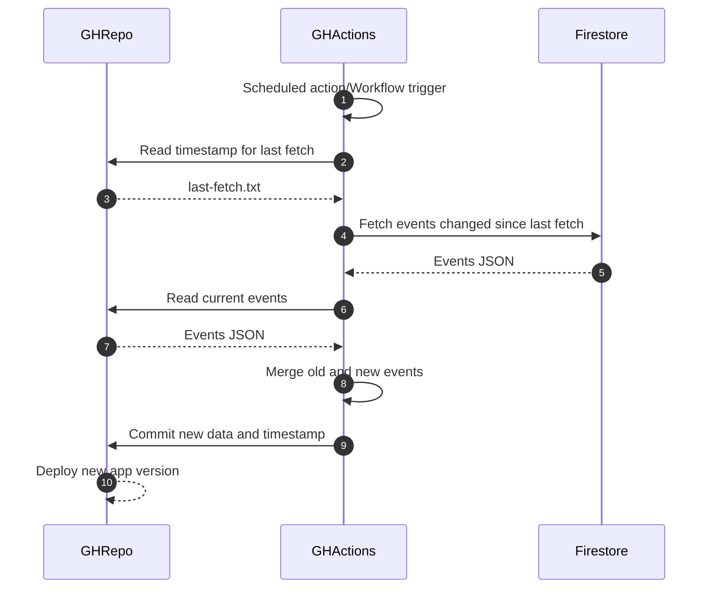

# alman-akka

🏳️‍🌈 event calendar

[](https://github.com/kaupunginnaiset/alman-akka/actions/workflows/ci.yml)
[](https://codecov.io/gh/kaupunginnaiset/alman-akka)

## Frontend

The frontend of this app uses NextJS and Node 16 together with Yarn 1.x as a package manager.

### Development

- Run `yarn` to install the required dependencies - you can find docs and installation guide for yarn [here](https://classic.yarnpkg.com/lang/en/) if you don't have it yet
- Run `nvm use` to set the required version with [NVM](https://github.com/nvm-sh/nvm)
- To fix linter errors, run `yarn next lint --fix` (when used with vscode, there is a setting in place for automatically formatting on save)

### Getting Started

First, start the firebase emulator:

```bash
yarn tools:emulator
```

Then, open another terminal and run the development server:

```bash
yarn dev
```

Open [http://localhost:3000](http://localhost:3000) with your browser to see the result.

The pages auto-update as you edit the files.

If adding events during development, you may want to ignore the development data files from git index:

```bash
git update-index --skip-worktree data/development/index.js
git update-index --skip-worktree data/development/last-fetch.txt
```

### Tests

You can run the unit tests using the command `yarn test`.
You can run the unit tests for the db scripts using the command `yarn test:db`.  
E2e-tests use Cypress and can be run with `yarn cypress`.

### Learn More About Next.js

To learn more about Next.js, take a look at the following resources:

- [Next.js Documentation](https://nextjs.org/docs) - learn about Next.js features and API.
- [Learn Next.js](https://nextjs.org/learn) - an interactive Next.js tutorial.

You can check out [the Next.js GitHub repository](https://github.com/vercel/next.js/) - your feedback and contributions are welcome!

### Deployment

The app is a static website deployed to GitHub pages.
The front page uses data files that are automatically generated. The data is stored in Firebase Firestore database.
Own events section initializes a Firebase connection and uses the Firestore database directly.

#### Events update

Events are updated through GitHub actions.



#### Setup

When developing, you can use the Firebase emulator for testing the Firebase functionality, so you do not need an actual Firebase connection.
However, if deploying the app with a new Firebase project, following steps are needed:

* [Create new firebase project](https://cloud.google.com/firestore/docs/client/get-firebase)
* [Enable Google authentication](https://firebase.google.com/docs/auth/web/google-signin#before_you_begin)
* [Enable Facebook authentication](https://firebase.google.com/docs/auth/web/facebook-login#before_you_begin)
* Setup Firestore
* Deploy Cloud Functions
